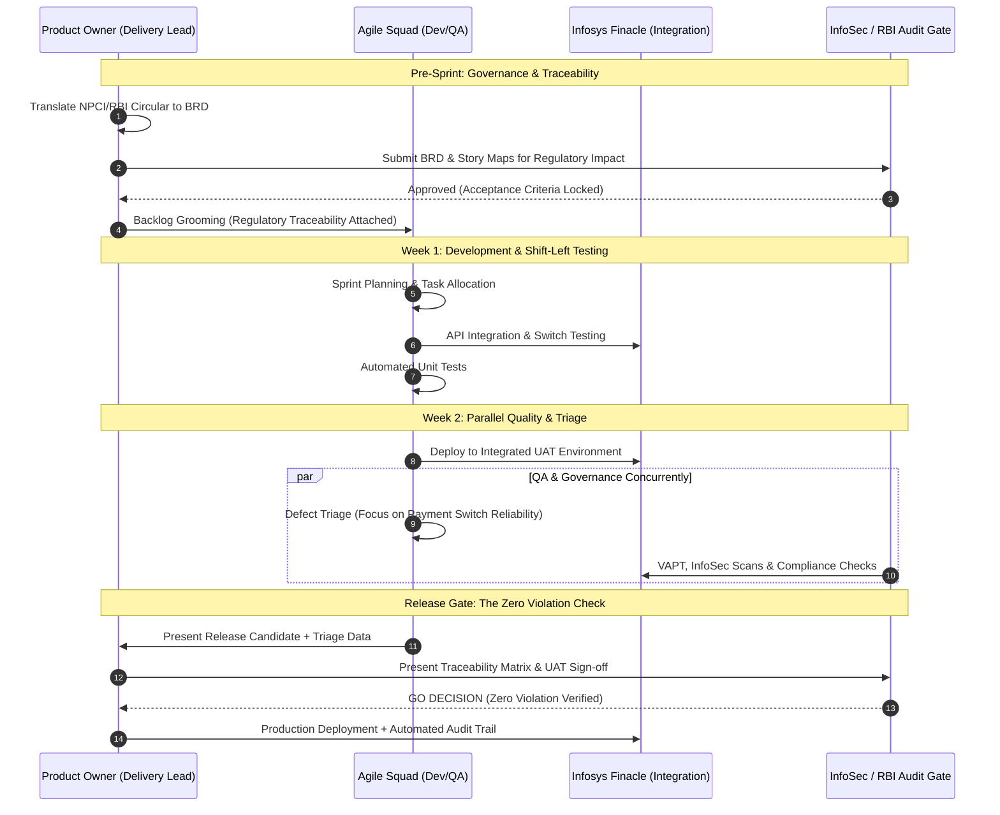

# 🏦 Federal Bank (Sanitized): Payments Product Delivery & RBI Compliance Engine

-238636?style=for-the-badge)

> **Architectural Thesis:** *Agile velocity and regulatory compliance are not a trade-off. By shifting RBI and NPCI governance to the "left" of the sprint and embedding auditability into the Definition of Done (DoD), compliance ceases to be a bottleneck and becomes a byproduct of disciplined execution.*

## 📑 Executive Abstract
This repository details the delivery architecture utilized to manage a high-stakes, consumer-facing payments portfolio (UPI, NEFT, IMPS) deeply integrated with **Infosys Finacle** core banking systems. Operating under the intense pressure of active Reserve Bank of India (RBI) audits, I engineered a hybrid PMP-Agile delivery model. This engine sustained a continuous release cadence across a 3.5-year product lifecycle without compromising systemic stability or regulatory standing.

---

## 📈 Business Impact & Delivery Metrics

The governance framework directly engineered the following operational and risk-mitigation outcomes:

*   🛡️ **100% Regulatory Adherence:** Executed 3.5 years of continuous delivery with **zero** NPCI or RBI Payment System Guidelines violations. Completely mitigated regulatory penalty risk during active audit cycles.
*   📉 **15% Reliability Lift:** Engineered a data-driven, systematic defect triage pipeline that identified and resolved technical declines, reducing overall payment failure rates by 15%.
*   🚀 **High-Velocity Output:** Shipped **3+ complex, consumer-facing payment features annually**, driving continuous customer value.
*   ⏱️ **Unbroken Release Cadence:** Sustained a **10-month continuous release cycle** running strictly on a 14-day Scrum sprint schedule, proving heavy Finacle integration and strict governance can operate within Agile constraints.

---

## 🏗️ The Methodology: "Compliance-by-Design"

Traditional Agile fails in highly regulated FinTech environments because documentation and risk management are treated as afterthoughts. By aggressively overlaying **PMP® delivery discipline** onto Scrum ceremonies, we created a self-auditing engine.

### 1. Scope Management: The Traceability Backlog
*   **The Execution:** Translated dense NPCI API specifications and RBI legal circulars into developer-ready Jira epics. Every User Story was mapped directly to approved Business Requirement Documents (BRDs). 
*   **The Outcome:** Acceptance Criteria (AC) were hardcoded with regulatory constraints. No story could enter the sprint without a verified regulatory traceability matrix.

### 2. Quality Management: Proactive Defect Triage
*   **The Execution:** Shifted from reactive bug-fixing to proactive stability engineering. Implemented a rigid triage protocol prioritizing the stability of the UPI/IMPS switch over UI edge-cases.
*   **The Outcome:** Direct attribution to the 15% reduction in transaction failures. Triage forced root-cause analysis (RCA) on Finacle sync timeouts within the sprint.

### 3. Integration Management: Stakeholder Orchestration
*   **The Execution:** Facilitated rigorous cross-functional alignment. Orchestrated UAT and integration touchpoints seamlessly between the Agile squads, external auditors, CISO/InfoSec, and Infosys core banking teams.

---

## 🔄 The 14-Day Shift-Left Compliance Sprint (Architecture)

To prove how governance was operationalized, the following sequence diagram illustrates our 2-week lifecycle. Audit and compliance gates are positioned *during* backlog refinement and the build phase, completely eliminating the standard pre-release regulatory bottleneck.

---

## 📁 Repository Artifacts (`/assets`)

This repository contains sanitized, structural templates used to manage this delivery pipeline. They serve as a highly tactical blueprint for executing Agile velocity in zero-tolerance compliance environments.

1.  **`sanitized_brd_upi_integration_traceability.pdf`**
    *   *Context:* A redacted BRD demonstrating how NPCI technical specifications and RBI data localization rules were mapped directly to actionable Jira Epic architectures.
2.  **`jira_workflow_compliance_gates.json`**
    *   *Context:* The exported Jira workflow configuration showcasing the mandatory custom fields and transition gates (e.g., `InfoSec Approval Ref`, `NPCI Circular #`) required to pass the Definition of Done.
3.  **`defect_triage_rca_dashboard.md`**
    *   *Context:* The Root Cause Analysis framework utilized for Finacle switch sync failures, illustrating the data-driven prioritization that drove the 15% reduction in technical declines.
4.  **`pmp_agile_communications_charter.xlsx`**
    *   *Context:* The stakeholder orchestration matrix detailing the cadence of risk-mitigation ceremonies between the Scrum team, CISO, and external RBI auditors.
